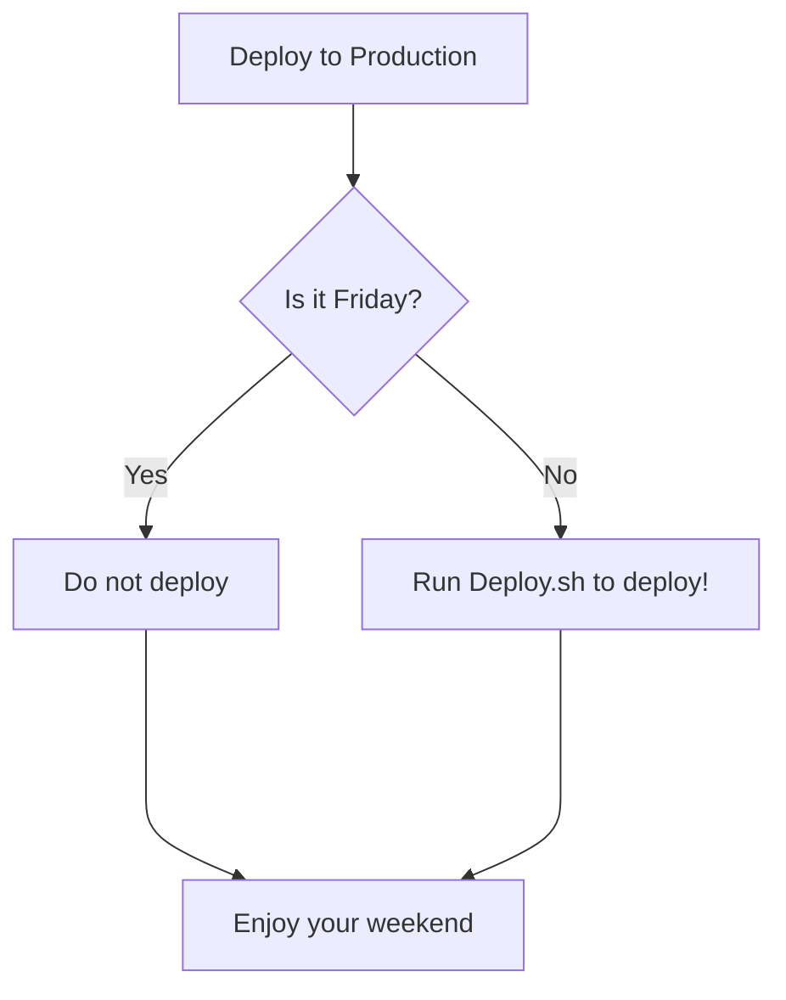

resources

And there it goes no replies will be shown 

Now let's see if that's had any impact on the web server we'll hit refresh here Yep boy that slowed it down quite a bit

As you can see it doesn't take a whole lot to degrade the performance of a server now think about this at scale this is just me with two different tools slowing down I'll be at a a slow server slow me down we'll call it you know demo server but you see but you can see the impact that we can have all right OK so that's a wrap on this demo we'll see you right that puts a wrap on this demo let's jump back into the discussion

### Mod 3
1. Have wireshark open
2. Scroll to http session
3. Right click and select follow stream
4. Identify the get http command and the servers response
5. click back
6. Expand Transmission control protocol
7. Call out three areas to focus on as we go through the http stream...TCP Segment length, Sequence Number, and acknowledgement number
8. Identify the raw sequence number.
9. Show where we can toggle from relative to just raw...relative makes it easier for us, but the real number is raw
10. Now show the sequence numbers and tell the learner to be prepared to calculate the next number based on both relative and raw
11. switch back to relative to do easier math
12. Call out after three way hand shake how you can see the sequence and acknowledgements in the main window
13. step to the fourth Get, which is we saw when we followed the stream.
14. Call out the TCP segment length is 480 and the next sequence number is 481
15. Step through the remaining
16. Make sure to the learner is prepared to do simple math with the relative sequence numbers v the raw sequence numbers...the math is the same.